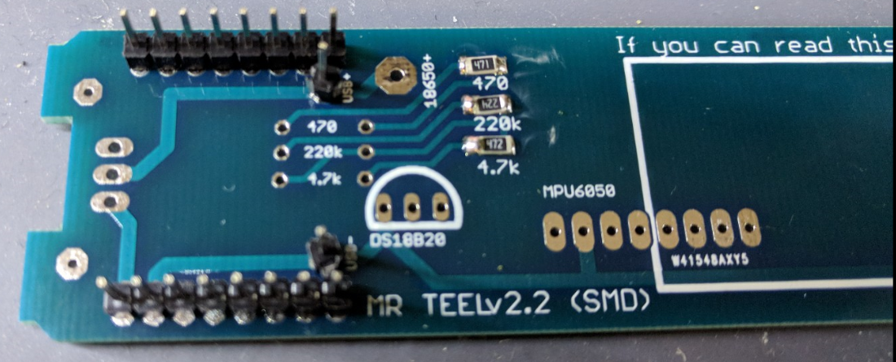
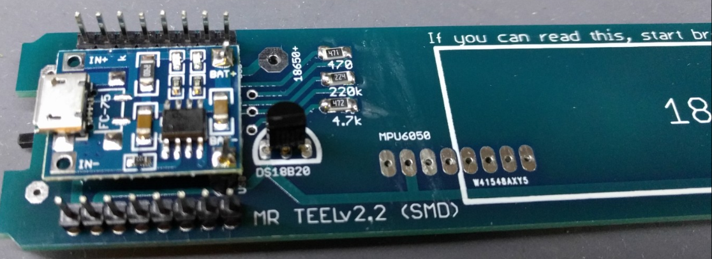
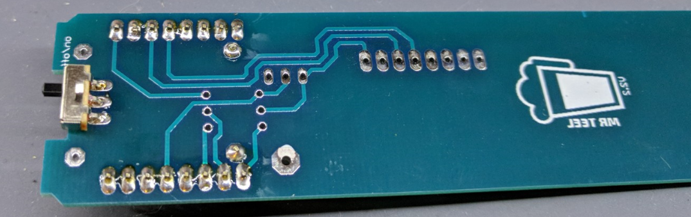
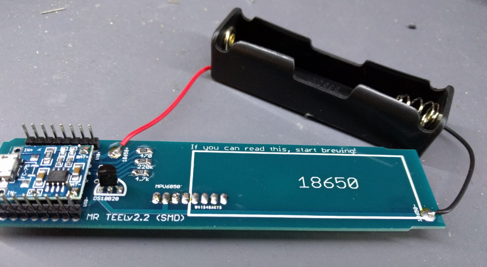

# MRTEEL Build Guide
<a href='https://github.com/tedelm/MRTEEL/blob/master/README.md'>Back to meny</a>  

## You can build with two different types of resistors, SMD or Thru hole.

-- under construction --

<h4>Parts</h4>
 
SMD (1206 size) version

| pcs | part | link |
| ------------- | ------------- | ------------- |
| 1 | 470k 1/4w Resistor | link |
| 1 | 220k 1/4w  Resistor | link |
| 1 | 4.7k 1/4w  Resistor | link |

Thru hole version

| pcs | part | link |
| ------------- | ------------- | ------------- |
| 1 | 470k 1/4w  Resistor | link |
| 1 | 220k 1/4w  Resistor | link |
| 1 | 4.7k 1/4w  Resistor | link |

Generic parts to combine with SMD or Thru hole version

| pcs | part | link |
| ------------- | ------------- | ------------- |
| 1 | DS18b20 | link |
| 1 | Wemos D1 Mini | link |
| 1 | MPU-5060 Gyro | link |
| 1 | TP4056 Li-On charger 5v1a | link |
| 1 | 18650 Li-On battery ~2200mah| link |
| 1 | 18650 Li-On Holder | link |
| 1 | 3-pin OnOff button ("Toy button") | link |
| 3 | 8-pin 2.54mm (male) | link |
| 4 | 1-pin 2.54mm (male) | link |
| 2 | 8-pin 2.54mm (female) | link |
| 1 | Anti-vibration M3 Sponge | <a href='https://www.banggood.com/Realacc-50PCS-Landing-Skid-Gear-Frame-Anti-vibration-M3-Sponge-for-ZMR250-QAV250-210-RC-Multirotor-p-1081168.html?rmmds=myorder&ID=224&cur_warehouse=CN'>link</a> |
| 1 | XL BIG PET Micro Geocaching container | link |

<h2>Assembly</h2>

### Wemos D1 mini
1. Flash the firmware to your Wemos (how to)
2. Solder the 8 female pins
3. Remove the 5v regulator beside the USB input
 
 
### MPU-6050
1. Remove the LED diod
2. Solder the 8 male pins to it, the MPU-6050 upside should be facing down to the MRTEEL PCB backside.

